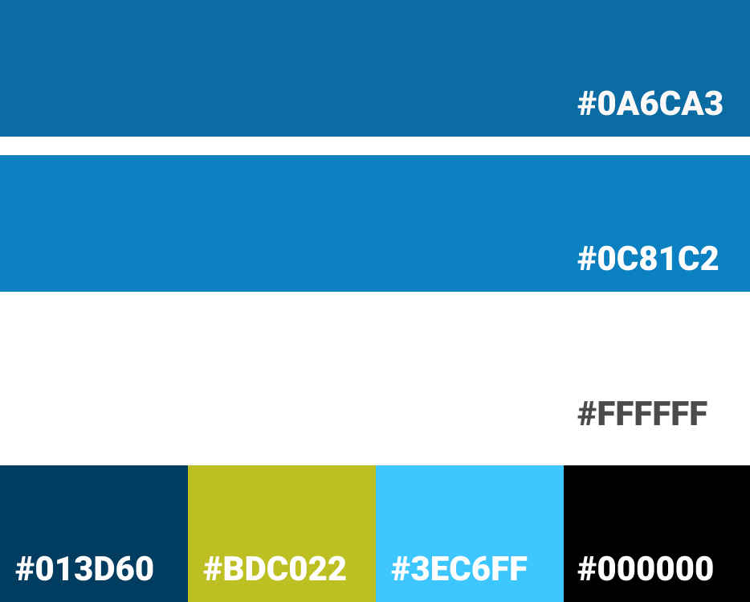

# **Milestone 2: (UN)PERFECT DATE**

### **Project - Interactive Frontend Development - Code Institute.**
This is the second milestone project from CI with a focus on HTML, CSS and JavaScript. The project is a fun and interactive game, with a visual novel to showcase the developers learning and skills with JavaScript.  

A deployed link to the website can be found **[here]()**.


## **Contents**
***
- [**User Experience (UX)**](<#user-experience-(ux)>)
  - [Project Goals](<#project-goals>)
  - [Importance and Feasibility chart](<#importance-and-feasibility-chart>)
  - [User Stories](<#user-stories>)
  - [Website Structure](<#website-structure>)
  - [Design Choices from UXD](<#design-choices-from-uxd>)
    - [Color Scheme](<#color-scheme>)
    - [Images](<#images>)
    - [Typography](<#typography>)
  - [Wireframes](<#wireframes>)
  - [Design Changes](<#design-changes>)

- [**Features**](<#features>)
  - [Existing Features](<#existing-features>)
  - [Features left to implement](<#features-left-to-implement>)

- [**Technologies**](<#technologies>)

- [**Testing**](<#testing>)

- [**Deployment**](<#deployment>)

- [**Credits**](<#credits>)

## **User Experience** (UX)
***

### **Project Goals**

### **Importance and Feasibility chart**

#### [Back to top](<#contents>)

### **User stories**

#### **First Time Visitor Goals**
* As a **first time user** I want to be able to navigate through the whole site smoothly.
* As a **first time user** I want to understand the purpose of the site upon loading it.
* As a **first time user** I want to be able to easily play the game on any device and view content clearly.
* As a **first time user** I want to easily be able to contact the developer for more information, feedback, issues or queries.
* As a **first time user** I want to have instructions on how to play the game so that I can easily understand the rules.
* As a **first time user** I want to be able to start a game when I am ready.
* As a **first time user** I want a way to start a new game when the current game has ended. 
* As a **first time user** I want to be able to access the games external social accounts.
* As a **first time user** I want to be able to enjoy an interactive game that is fun and is replayable.

#### **Site Owner Goals**
* As a **site owner** I want to showcase the skills I have learnt in HTML, CSS and JavaScript.
* As a **site owner** I want to provide users with an interactive game to play.
* As a **site owner** I want to create an enjoyable, interactive game that makes the user want to stay and play again.
* As a **site owner** I want to create a game that makes the user want to return to the website.
* As a **site owner** I want to make a game that I would enjoy playing.
* As a **site owner** I want users to be able to contact the developer for collaboration, queries, feedback and network.

#### [Back to top](<#contents>)

### **What is needed now and in the future?**

#### [Back to top](<#contents>)

### **Website Structure**

#### [Back to top](<#contents>)

### **Design Choices from UXD**
***

#### [Back to top](<#contents>)

### **Color Scheme**

The general color scheme is different color shades of blue and white. With some color details consistent of yellow, green and black. These colors will create a consistent style for the game. There are also other colors; from the characters and image backgrounds for the game.



### **Images**

### **Typography**

#### [Back to top](<#contents>)

### **Wireframes**
|Sketches|Wireframes & Designs|                        
|:-----:|:----:|
|[Sketches]()| [Wireframes & Designs](assets/images/readme/wireframes&designs.pdf)

### **Design changes**

#### [Back to top](<#contents>)

## **Features**
***

### **Existing Features**

Included in the **game** is:

* **Head banner:** Which alerts the user that there are new stories and characters coming soon. 
* **Characters:** A group of six avatars. Two which will be mainly used in this game, with some different emotions and positures. 
* **Logo and developers name:** A logo telling the name of the game "(UN)PERFECT DATE" and who it is by.  
* **Start a game button:** To begin the game.  
* **How To Play button:** Where the user can click and a modal shows up explaining the way to interact with the game.
* **Contact button:** Where the user can click and a modal pops up with a contact form and socials(leads to external sites). The user can then fill out the form with email and message query (with validation, “@” and “.” etc.) and submitted to contact the developer.
* **Modal:** A modal that lets the user know they have been successful in sending the message.
* **Text boxes:** To showcase the story and dialogue, and in some parts the name of a character.  
* **Backgrounds:** Three images to give a scenery for the game as the user plays along. 
* **Option buttons:** To give the user options and make use of their decision making skills. 
* **Try Again button:** In the end there will be an option to try the game again for a different outcome.
* **Hidden Score:** To add points as one goes along the story to be added for different endings. 
* **Mobile/Text message interaction:** A mobile call/text message interactive part of the storyline comes up.
* **Ending page:** Based on the hidden score there will be a couple of different endings based on the users choices, as well as a try again and contact button. 
* **404 page:** A message telling the user they have accessed a page which does not exist. Including a button which is linked to index.html that prompts them to return to the site.


### **Features Left to Implement**

#### [Back to top](<#contents>)

## **Technologies**
***

### **Languages**

* [HTML5](https://en.wikipedia.org/wiki/HTML5 "HTML5") - provides the content and structure for the game.
* [CSS3](https://en.wikipedia.org/wiki/Cascading_Style_Sheets "CSS3") - provides the styling.
* [JavaScript](https://en.wikipedia.org/wiki/JavaScript) -provides the interactivity and functionality throughout the game.

### **Frameworks, Libraries & Programs**

* [Bootstrap](https://getbootstrap.com/ "Bootstrap") - used to create the layout of the project.
* [Figma](https://www.figma.com/ "Figma") - used to create the projects wireframes, designs and logo.
* [Gitpod](https://www.gitpod.io/ "Gitpod") - used to develop the website.
* [GitHub](https://github.com/ "GitHub") - used to host the project.
* [Git](https://git-scm.com/) -used for version control.
* [Git Pages](https://pages.github.com/) - used to deploy the live site. 
* [Trello ](https://trello.com/ "Trello ") - used for time and project management.
* [Ilovepdf](https://www.ilovepdf.com/compress_pdf "Ilovepdf") - used for compressing pdf files.
* [TinyJPG](https://tinyjpg.com/) - used to reduce image file sizes. 
* [Google Fonts](https://fonts.google.com/) - used for typography.
* [Font Awesome](https://fontawesome.com/) - used for icons.
* [FavIcon](https://favicon.io/) -used for compressing logo into favIcons.
* [Google Chrome Developer Tools](https://developers.google.com/web/tools/chrome-devtools) -used to inspect page elements, test different CSS styles, debug issues and responsiveness.

## **Testing**
***

#### [Back to top](<#contents>)

## **Deployment**
***

### Project Creation
Navigate to the **[template](https://github.com/Code-Institute-Org/gitpod-full-template)** and click 'Use this template'. Put in Repository name ((UN)PERFECT DATE) and check the Include all branches checkbox. Then navigate to the new **[repository](https://github.com/VTwin90/-UN-PERFECT-DATE)**.

The following commands were used for version control throughout the project:
+ ```git status``` (checks which files have been modified or added, and ready to be committed)
+ ```git add . ``` or ```git add <filename>``` (add all changed files, or specific files within the project directory to be committed)
+ ```git commit -m "[TYPE] Reason"``` (commit changes to the local repository)
+ ```git push``` (push all committed changes to the GitHub repository)

### **Deployment to Github pages**

1. Push project to GitHub. Navigate and log into the GitHub site.
2. Go to repositories and select the one associated to this project: **[Milestone 1 Portfolio](https://github.com/VTwin90/-UN-PERFECT-DATE)**.
3. On the main repository, click "Settings" and scroll to "Github Pages".
4. Under "Source" select "Master Branch" and click "Save".
5. Click on the link to go to the live deployed page.

The live link for the site is here: **[]()**

### **Create a local clone**

1. Open GitHub and navigate to repository **[here](https://github.com/VTwin90/-UN-PERFECT-DATE)**.
2. Click the Code drop down menu. 
3. Options: 
* Download the ZIP file, unpack locally and open with IDE.  
* Copy git URL from HTTPS dialogue box. 
4. Open your chosen IDE and open terminal in a directory. 
5. Use ```git clone``` command with the copied git URL after.
6. Clone of the project is created locally on your machine.

### **Fork Project**

1. Navigate to the GitHub Repository you want to **[fork](https://github.com/VTwin90/-UN-PERFECT-DATE)**.
2. On the top right of the page under the header, click the fork button.
3. Creates a duplicate of the full project in your GitHub Repository.

#### [Back to top](<#contents>)

## **Credits**
***

### **Code**

### **Media & Content**

### **Acknowledgments**

#### [Back to top](<#contents>)