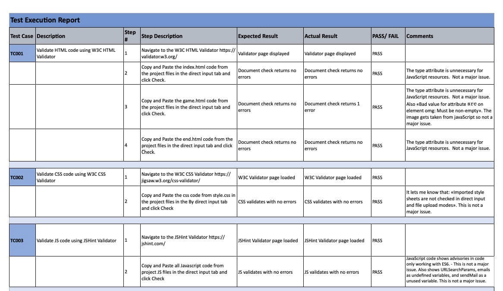
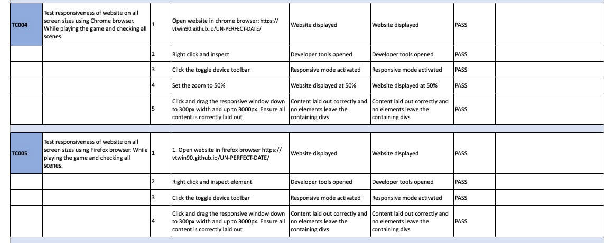
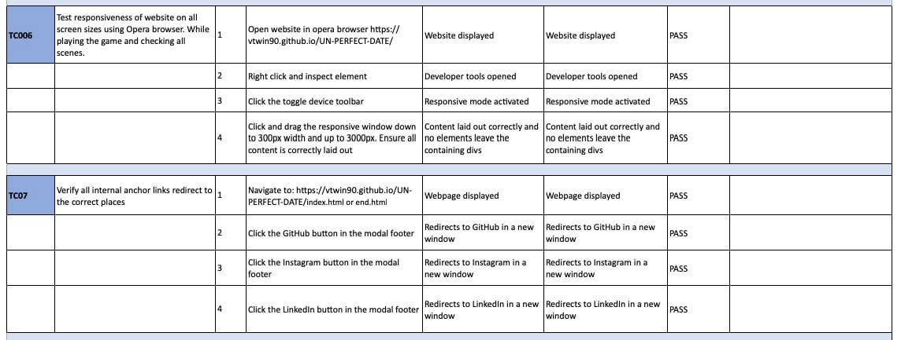
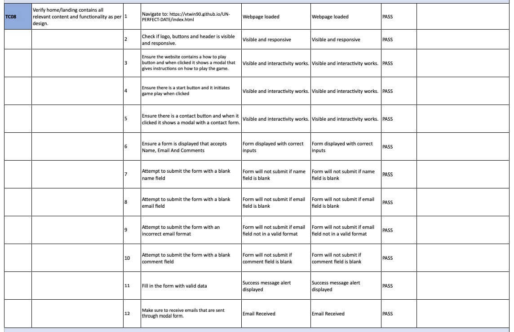
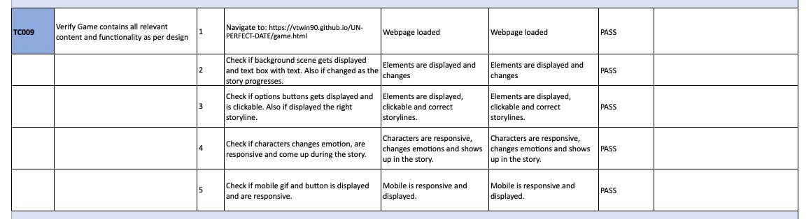
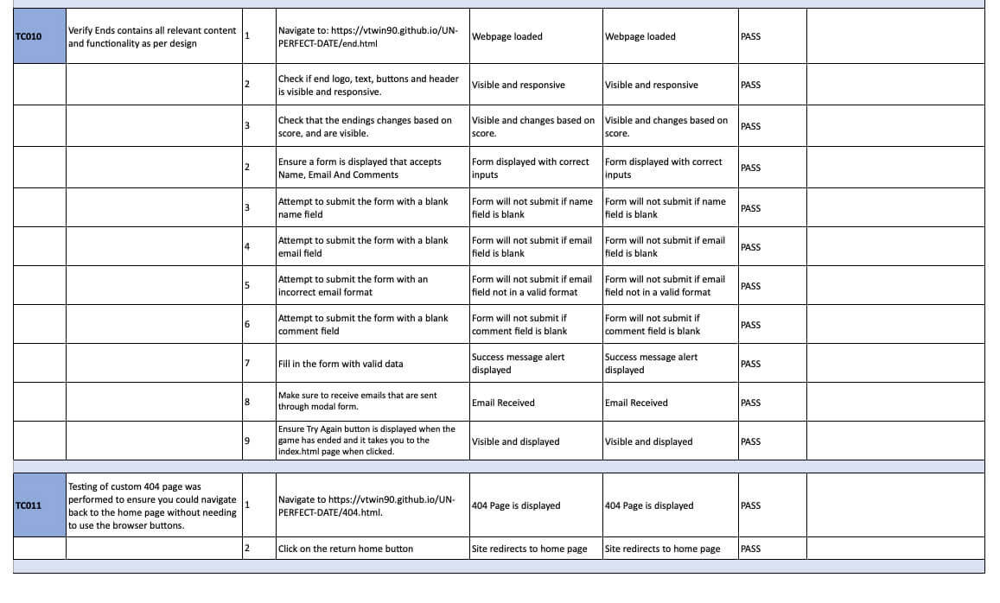
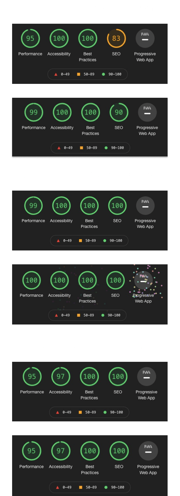

 # Test Cases and Execution Report

Full downloadable excel document can be found [here](assets/images/testing/testResults.xlsx).

Please note these results are a .xlsx file and will require excel, google docs or a compatible program to open the file.

## User Story Testing

### User Story:
> As a first time user I want to be able to navigate through the whole site smoothly.

Tests Covering story:
* TC007
* TC008
* TC009
* TCO10
* TCO11

### User Story:
> As a first time user I want to understand the purpose of the site upon loading it.

Tests Covering story:
* TC008

### User Story:
> As a first time user I want to be able to easily play the game on any device and view content clearly.

Tests Covering story:
* TC004
* TC005
* TC006
* TCO07
* TCO08
* TCO09
* TCO10

### User Story:
> As a first time user I want to easily be able to contact the developer for more information, feedback, issues or queries.

Tests Covering story:
* TC007
* TC008
* TCO10

### User Story:
> As a first time user I want to have instructions on how to play the game so that I can easily understand the rules.

Tests Covering story:
* TC008

### User Story:
> As a first time user I want to be able to start a game when I am ready.

Tests Covering story:
* TC008

### User Story:
> As a first time user I want a way to start a new game when the current game has ended.

Tests Covering story:
* TCO10

### User Story:
> As a first time user I want to be able to access the games external social accounts.

Tests Covering story:
* TC007

### User Story:
> As a first time user I want to be able to enjoy an interactive game that is fun and is replayable.

Tests Covering story:
* TC008
* TC009
* TC010

### User Story:
> As a site owner I want to showcase the skills I have learnt in HTML, CSS and JavaScript.

Tests Covering story:
* TC001-TC011

### User Story:
> As a site owner I want to provide users with an interactive game to play.

Tests Covering story:
* TC001-TC011

### User Story:
> As a site owner I want to create an enjoyable, interactive game that makes the user want to stay and play again.

Tests Covering story:
* TC001-TC011

### User Story:
> As a site owner I want to create a game that makes the user want to return to the website.

Tests Covering story:
* TC001-TC011

### User Story:
> As a site owner I want to make a game that I would enjoy playing.

Tests Covering story:
* TC001-TC011

### User Story:
> As a site owner I want users to be able to contact the developer for collaboration, queries, feedback and network.

Tests Covering story:
* TC007
* TC008
* TCO10

# Issues and Resolutions

## Image Responsiveness:

**Issue:**

The background images was getting either stretched or not covering the device.

**Resolution:**
* Add styling html/body height of 100%.
* Add stylings to scene:  background-repeat: no-repeat; background-size: cover; height: 100%; object-fit: cover; margin: auto;

## Text box container:

**Issue:**
The text box container was in some cases empty but still visible on other pages. 

**Resolution:**
* Fixed by removing btns and containers in game.js function showPage(pageIndex), and adding text container or btn when needed in the game. Code: optionButtonsElement.innerHTML = ''; textContainer.innerHTML = '';.

## AddEventListener

**Issue:**
In the consol, every time the click event happened in the game, there was a massive number of clicks/runs.  

**Resolution:**
Fixed this by adding some code to the function showPage(pageIndex), in the if (page.options.length === 0). Like: 

* const textContainerClone = textContainer.cloneNode(true);
* textContainerClone.appendChild(text);
* textContainer.replaceWith(textContainerClone);

## Changing Scenes: 

**Issue:**
How to change scenes throughout the story.

**Resolution:**
This got solved by adding this to function showPage(pageIndex):
* document.getElementById('scene').src = 'assets/images/scenes/' + page.image;
* and adding image: 'street.jpg' to data.js const pages.

# Lighthouse Report Mobile & Desktop

